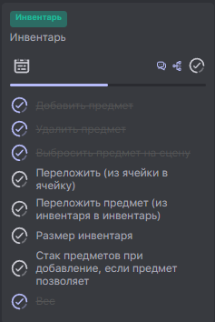
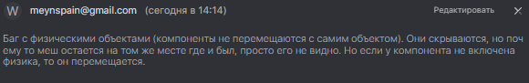
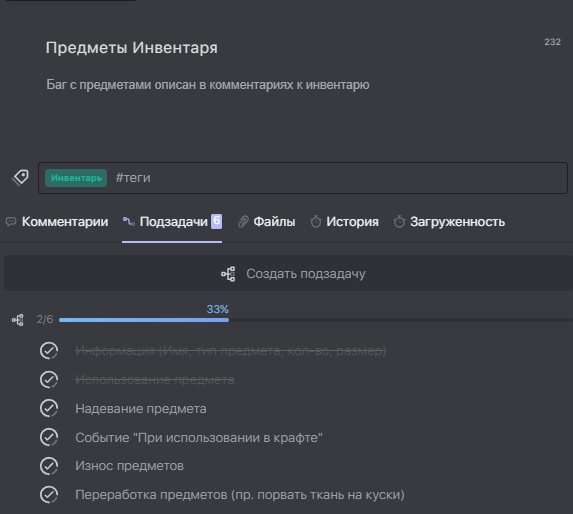

# SurvirvalShooter

Developed with Unreal Engine 4  
  
Link to the task board: https://app.weeek.net/ws/291518/project/3/board/4 

# Branches
## Master
Init Project.
## Develop
Add:  
* First person view
* Third Person view
* Switching between views
* Helth Stats Component
    * Helth
    * Hunger
    * Thirst 
    * Stamina
* Level Stats Component
    * Level
    * Experiens
    * Experience for next level
* Speeding on "Left Shift"
* Crouch on "Left Ctrl", but no animation
* Simple event Any Damage
* Event Death (enable Ragdall)
## Feature/Inventory  
### Commits
SS-04 #comment Add Storage Component and Storage Item  
  
  

  

